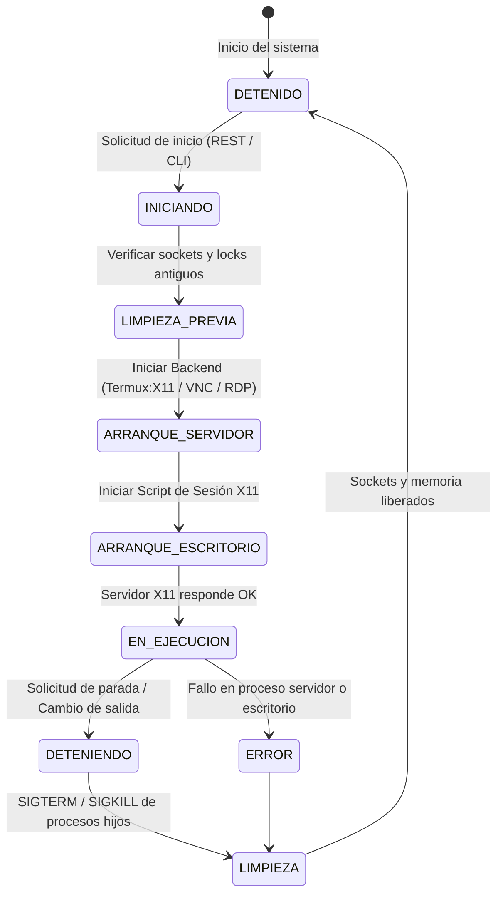

# 🏛️ Arquitectura del Sistema: Termux Display Manager (TDM)

## 1. Diagrama de Capas

```
┌────────────────────────────────────────────────────────────────────────┐
│                        CAPA DE USUARIO / FRONTEND                      │
│                                                                        │
│   [ 📱 Android WebView App ]    [ 💻 Navegador Web ]    [ ⌨️ CLI tdm ] │
└───────────────────┬──────────────────────┬────────────────────┬────────┘
                    │                      │                    │
                    │ HTTP REST / WS       │ HTTP REST / WS     │ Llamada Local
                    ▼                      ▼                    ▼
┌────────────────────────────────────────────────────────────────────────┐
│                        TDM CORE SERVICE (Python Asyncio)               │
│                                                                        │
│  • REST API Router & WebSockets Dispatcher                             │
│  • Screen State Supervisor (Singleton Display Manager)                 │
│  • Native DE Detector (KDE, MATE, XFCE4, LXQt, i3)                     │
│  • PulseAudio / VirGL Environment Builder                              │
└───────────────────────────────────┬────────────────────────────────────┘
                                    │
       ┌────────────────────────────┼────────────────────────────┐
       ▼                            ▼                            ▼
┌──────────────┐             ┌──────────────┐             ┌──────────────┐
│  Termux:X11  │             │    noVNC     │             │     xrdp     │
│   Backend    │             │   Backend    │             │   Backend    │
└──────┬───────┘             └──────┬───────┘             └──────┬───────┘
       │                            │                            │
       │ X11 Socket                 │ VNC + WebSockets           │ RDP Protocol
       ▼                            ▼                            ▼
┌────────────────────────────────────────────────────────────────────────┐
│                   ESCRITORIO NATIVO ACTIVO (:0)                        │
│             (startplasma-x11 / mate-session / xfce4-session)           │
└────────────────────────────────────────────────────────────────────────┘
```

---

## 2. Flujo de Estados de una Pantalla



---

## 3. Preparación de Variables de Entorno y D-Bus

Antes de lanzar el escritorio, TDM inyecta un entorno limpio adaptado a Termux:
* `DISPLAY=:0`
* `XDG_RUNTIME_DIR=$HOME/.tdm/run/user-$UID-display-0`
* `GDK_BACKEND=x11`
* `QT_QPA_PLATFORM=xcb`
* `PULSE_SERVER=127.0.0.1:4713` (si el audio está activo)
* `GALLIUM_DRIVER=virpipe` / `LIBGL_ALWAYS_SOFTWARE=1` (según VirGL)
* Sesión D-Bus lanzada mediante `dbus-launch --sh-syntax`.
